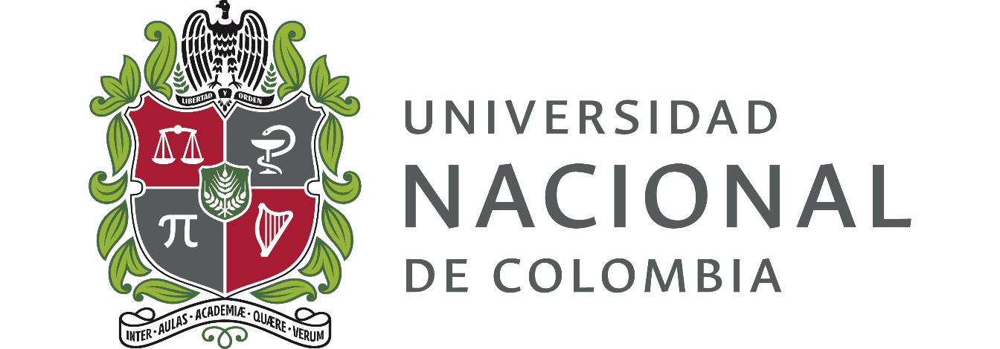
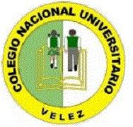

Estudiante de Ingeniería Ambiental en la Universidad Nacional de Colombia interesado en el análisis de datos, la ecología y la las visualizaciones. Graduado de una tecnología en Control Ambiental del Servicio Nacional de Aprendizaje y bachiller técnico con énfasis en medio ambiente del Colegio Nacional universitario de Vélez, Santander.

<table width="100%" border="0">
<tr>
<td><left>
 
</left></td>
<td></td>
<td><left>
 
</left></td>
<td width="70"></td>
<td>

 

</td>
</tr>
</table>

 

 
CURRICULUM VITAE

<left>
 
</left>

<!-- Aca inicia el footer -->

 

<footer id="footer">

<h3 class="widget-title">Contact</h3>

+57 <a href="mailto:duvanieves@misena.edu.co">e-mail</a> Pilarica Robledo, Medellín, Colombia

<h3 class="widget-title">Follow me</h3>

<a href="https://www.facebook.com/Duvancho321" target="_blank"><i class="fa fa-facebook-square fa-2"></i></a>
<a href="https://twitter.com/DuvanNievesRui1" target="_blank"><i class="fa fa-twitter-square fa-2"></i></a>
<a href="https://www.instagram.com/el.individuo" target="_blank"><i class="fa fa-instagram fa-2"></i></a>
<a href="https://github.com/Duvancho321" target="_blank"><i class="fa fa-github fa-2"></i></a>

<h3 class="widget-title">Text widget</h3>

Necesitamos tomar la información, donde esté guardada, hacer nuestras copias y compartirlas con el mundo. Necesitamos tomar las cosas que no tengan copyright y añadirlas al archivo. Necesitamos pelear por el Guerilla Open Access. Suficientes de nosotros, alrededor del mundo, no solo mandaremos un mensaje fuerte que se opone a la privatización del conocimiento - lo haremos una cosa del pasado. ¿Te unirás a nosotros?

<h3 class="widget-title">Contact</h3>

+57 <a href="mailto:duvanieves@misena.edu.co">e-mail</a> Pilarica Robledo, Medellín, Colombia

 

</footer>

<footer id="underfooter">

Pilarica Robledo, Medellín, Colombia

Copyleft© 2019, Duvan Nieves  Design: <a href="http://www.gettemplate.com" rel="designer">Initio by GetTemplate</a>

 

</footer>
