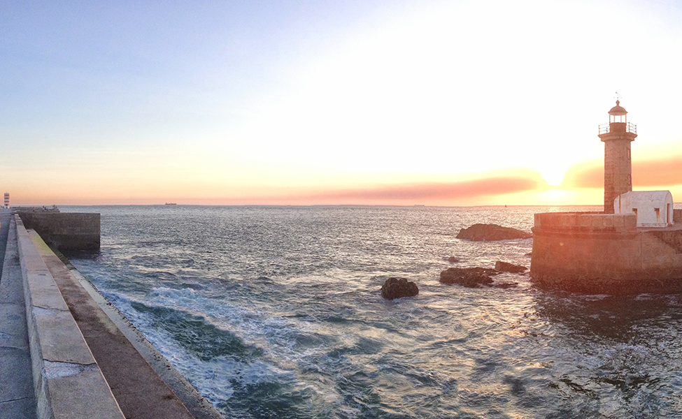
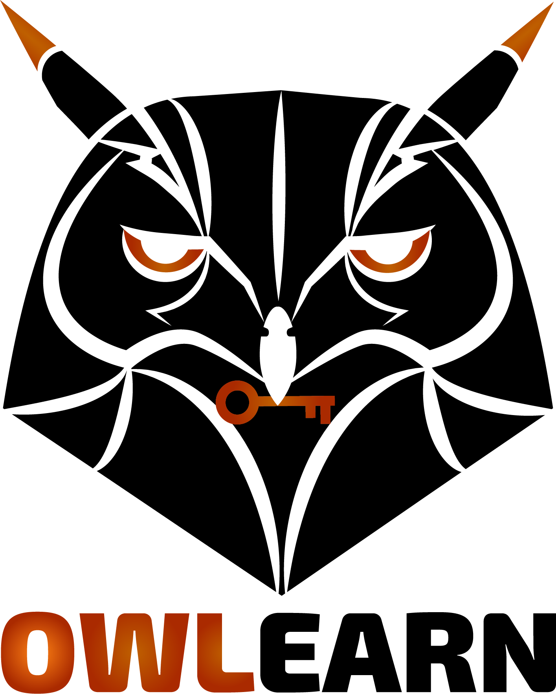

<h2 class="section-title">Recent Works</h2>

<html>
<head>

</head>
<body>

  <a class="thumbnail"  target="_blank" href="img_mountains.jpg">
         
           
           See details →
       
       Titulo
  </a>

  <a class="thumbnail"  target="_blank" href="img_mountains.jpg">
         
           
           See details →
       
       Titulo
  </a>

  <a class="thumbnail"  target="_blank" href="img_mountains.jpg">
         
           
           See details →
       
       Titulo
  </a>

  <a class="thumbnail"  target="_blank" href="img_mountains.jpg">
         
           
           See details →
       
       Titulo
  </a>

  <a class="thumbnail"  target="_blank" href="https://duvancho321.github.io/Material-Unal/">
         
           
           See details →
       
       Material Unal Medellín
  </a>

</body>
</html>

<!-- Aca inicia el footer -->

 

<footer id="footer">

<h3 class="widget-title">Contact</h3>

+57 <a href="mailto:duvanieves@misena.edu.co">e-mail</a> Pilarica Robledo, Medellín, Colombia

<h3 class="widget-title">Follow me</h3>

<a href="https://www.facebook.com/Duvancho321" target="_blank"><i class="fa fa-facebook-square fa-2"></i></a>
<a href="https://twitter.com/DuvanNievesRui1" target="_blank"><i class="fa fa-twitter-square fa-2"></i></a>
<a href="https://www.instagram.com/el.individuo" target="_blank"><i class="fa fa-instagram fa-2"></i></a>
<a href="https://github.com/Duvancho321" target="_blank"><i class="fa fa-github fa-2"></i></a>

<h3 class="widget-title">Text widget</h3>

Necesitamos tomar la información, donde esté guardada, hacer nuestras copias y compartirlas con el mundo. Necesitamos tomar las cosas que no tengan copyright y añadirlas al archivo. Necesitamos pelear por el Guerilla Open Access. Suficientes de nosotros, alrededor del mundo, no solo mandaremos un mensaje fuerte que se opone a la privatización del conocimiento - lo haremos una cosa del pasado. ¿Te unirás a nosotros?

<h3 class="widget-title">Contact</h3>

+57 <a href="mailto:duvanieves@misena.edu.co">e-mail</a> Pilarica Robledo, Medellín, Colombia

 

</footer>

<footer id="underfooter">

Pilarica Robledo, Medellín, Colombia

Copyleft© 2019, Duvan Nieves  Design: <a href="http://www.gettemplate.com" rel="designer">Initio by GetTemplate</a>

 

</footer>